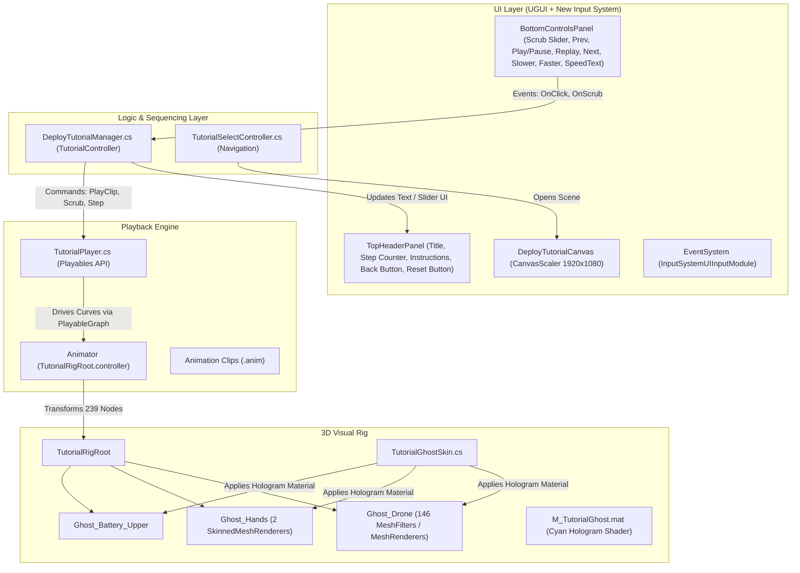

# Deploy For Flight Tutorial Module

## 1. Overview & Purpose

The **Deploy For Flight** screen (`Assets/Screens/DeployForFlightScreen/DeployForFlight.unity`) is an interactive 3D training module within the **MobileTrainer** application. Its objective is to teach learners the complete mechanical procedure required to transition the Vega 2.0 industrial drone from its folded transport/storage state into full operational flight readiness.

Like the companion **Fold For Storage** module, this system provides:
* **True 3D Visualization**: Real-time rendering of drone sub-assemblies (arms, sliders, latches, landing gear legs, and propellers) moving in 3D space.
* **Synchronized Ghost Hands**: Animated human hands demonstrate natural grasp positions, pinch points, and push actions for every mechanism.
* **Interactive Control**: Step-by-step navigation, pause/play, replay, speed adjustment (0.25x - 2.0x), camera reset, and bidirectional timeline scrubbing.
* **Mobile-First UX**: Responsive UI scaled for mobile screens (1920x1080) with touch interaction handled through Unity’s New Input System.

---

## 2. System Architecture

### 2.1. Core Script Attachment & Host GameObjects

In the scene [`DeployForFlight.unity`](file:///Volumes/Baracuda/Unity/MobileTrainer/Assets/Screens/DeployForFlightScreen/DeployForFlight.unity):

| Script | Host GameObject | Hierarchy Location | Purpose |
| :--- | :--- | :--- | :--- |
| [`DeployTutorialManager.cs`](file:///Volumes/Baracuda/Unity/MobileTrainer/Assets/Screens/DeployForFlightScreen/Scripts/DeployTutorialManager.cs) | **`TutorialController`** | Root level | High-level sequencer managing tutorial steps, UI text updates, slider scrubbing, speed adjustment, and button events. |
| [`TutorialPlayer.cs`](file:///Volumes/Baracuda/Unity/MobileTrainer/Assets/Screens/FoldForStorageScreen/Scripts/TutorialPlayer.cs) | **`TutorialRigRoot`** | Root level | Low-level playback engine using Unity's Playables API to directly drive the `Animator` component with step clips and trim timestamps. |
| [`TutorialGhostSkin.cs`](file:///Volumes/Baracuda/Unity/MobileTrainer/Assets/Screens/FoldForStorageScreen/Scripts/TutorialGhostSkin.cs) | **`TutorialRigRoot`** | Root level | Traverses all child ghost branches under `TutorialRigRoot` on `Awake()` and applies theme materials and step highlights. |
| [`SliderEventBridge.cs`](file:///Volumes/Baracuda/Unity/MobileTrainer/Assets/Screens/FoldForStorageScreen/Scripts/SliderEventBridge.cs) | **`TimelineSlider`** | `Canvas/BottomControlsPanel` | Intercepts pointer events, manages 70px touch hit target, and drives instant jump-to-point and drag scrubbing. |
| [`ModelCameraController.cs`](file:///Volumes/Baracuda/Unity/MobileTrainer/Assets/Screens/FoldForStorageScreen/Scripts/ModelCameraController.cs) | **`Main Camera`** | Root level | Interactive orbit, pinch-to-zoom, pan, and orientation reset around the drone pivot. |

---

## 3. How the 3D Animation & Rig Work

### 3.1. Animation Binding Principle
Unity animation clips (`.anim`) store transformation curves keyed to **GameObject hierarchy paths** (e.g., `Ghost_Drone/Body/Right_Arm/Latch`).
* The animation curves were baked against a root called `TutorialRigRoot`.
* Under `TutorialRigRoot` there are **239 precisely named Transform nodes**, matching the paths expected by all animation clips.
* The rig is split into five main branches:
  1. `Ghost_Drone`: Central fuselage, arms, folding joints, body latches, and sliders.
  2. `Ghost_Battery_Upper`: The battery pack and its rotating release handle.
  3. `Ghost_Arm_BackRight`: Articulation branch for the rear folding arm.
  4. `Ghost_HandLeft`: Left hand bone hierarchy with an `XRHand_Wrist` joint tree driving a `SkinnedMeshRenderer`.
  5. `Ghost_HandRight`: Right hand bone hierarchy with an `XRHand_Wrist` joint tree driving a `SkinnedMeshRenderer`.

### 3.2. Geometry Attachments
* **Drone Geometry**: Submeshes of `Assets/Screens/FoldForStorageScreen/Models/VEGA 2.0 10062026.obj` referenced across 146 rig MeshFilters.
* **Hand Geometry**: Skinned meshes from `LeftHand.fbx` and `RightHand.fbx` under `Assets/Screens/FoldForStorageScreen/Models/Hands/`.

---

## 4. Step Sequencing (`DeployTutorialManager.cs`)

`DeployTutorialManager.cs` orchestrates the complete deployment procedure across 27 authored steps.

### The 27 Deployment Stages

| Step # | Title | Instruction Text | Animation Clip (.anim) | Highlight Targets |
| :---: | :--- | :--- | :--- | :--- |
| **1** | Deploy one landing gear | Use the THUMB to push the button on each leg of the landing gear AND grab the leg AT THE SAME TIME to swing it outwards. | `unfold_open_landing_gear_2.anim` | `Landing_Gear_Root_2` |
| **2** | Deploy the other landing gear | Use the THUMB to push the button on each leg of the landing gear AND grab the leg AT THE SAME TIME to swing it outwards. | `unfold_open_landing_gear_1.anim` | `Landing_Gear_Root_1` |
| **3** | Swing out the front-left arm | Use the THUMB to push the front-right release button AND grab the sub-arm AT THE SAME TIME to swing it outwards. | `unfold_open_front_left_subarm.anim` | `Body_Front_Left` |
| **4** | Open the front-left latch | Pinch the front-left latch and swing it fully open. | `unfold_open_front_left_latch.anim` | `Clamp_Front_Left_Latch` |
| **5** | Return the front-left slider | Slide the front-left slider all the way home. | `unfold_slide_front_left_slider.anim` | `Clamp_Front_Left_Slider` |
| **6** | Close the front-left latch | Swing the front-left latch shut to lock the slider. | `unfold_close_front_left_latch.anim` | `Clamp_Front_Left_Latch` |
| **7** | Swing out the front-right arm | Use the THUMB to push the front-right release button AND grab the sub-arm AT THE SAME TIME to swing it outwards. | `unfold_open_front_right_subarm.anim` | `Body_Front_Right` |
| **8** | Open the front-right latch | Grab the front-right latch and swing it fully open. | `unfold_open_front_right_latch.anim` | `Clamp_Front_Right_Latch` |
| **9** | Return the front-right slider | Slide the front-right slider all the way home. | `unfold_slide_front_right_slider.anim` | `Clamp_Front_Right_Slider` |
| **10** | Close the front-right latch | Swing the front-right latch shut to lock the slider. | `unfold_close_front_right_latch.anim` | `Clamp_Front_Right_Latch` |
| **11** | Swing out the back-left arm | Use the THUMB to push the back-left release button AND grab the sub-arm AT THE SAME TIME to swing it outwards. | `unfold_open_back_left_subarm.anim` | `Body_Back_Left` |
| **12** | Open the back-left latch | Grab the back-left latch and swing it fully open. | `unfold_open_back_left_latch.anim` | `Clamp_Back_Left_Latch` |
| **13** | Return the back-left slider | Slide the back-left slider all the way home. | `unfold_slide_back_left_slider.anim` | `Clamp_Back_Left_Slider` |
| **14** | Close the back-left latch | Swing the back-left latch shut to lock the slider. | `unfold_close_back_left_latch.anim` | `Clamp_Back_Left_Latch` |
| **15** | Swing out the back-right arm | Use the THUMB to push the back-right release button AND grab the sub-arm AT THE SAME TIME to swing it outwards. | `unfold_open_back_right_subarm.anim` | `Body_Back_Right` |
| **16** | Open the back-right latch | Pinch the back-right latch and swing it fully open. | `unfold_open_back_right_latch.anim` | `Clamp_Back_Right_Latch` |
| **17** | Return the back-right slider | Slide the back-right slider all the way home. | `unfold_slide_back_right_slider.anim` | `Clamp_Back_Right_Slider` |
| **18** | Close the back-right latch | Swing the back-right latch shut to lock the slider. | `unfold_close_back_right_latch.anim` | `Clamp_Back_Right_Latch` |
| **19** | Open both halves | Grab both halves of the drone and rotate them back out to zero together. | `unfold_open_both_body_arms.anim` | `Body_Half_Left`, `Body_Half_Right` |
| **20** | Open the left body latch | Grab the left body latch and swing it fully open. | `unfold_open_body_left_latch.anim` | `Clamp_Body_Left_Latch` |
| **21** | Return the left body slider | Slide the left body slider all the way home. | `unfold_slide_body_left_slider.anim` | `Clamp_Body_Left_Slider` |
| **22** | Close the left body latch | Swing the left body latch shut to lock the slider. | `unfold_close_body_left_latch.anim` | `Clamp_Body_Left_Latch` |
| **23** | Open the right body latch | Grab the right body latch and swing it fully open. | `unfold_open_body_right_latch.anim` | `Clamp_Body_Right_Latch` |
| **24** | Return the right body slider | Slide the right body slider all the way home. | `unfold_slide_body_right_slider.anim` | `Clamp_Body_Right_Slider` |
| **25** | Close the right body latch | Swing the right body latch shut to lock the slider. | `unfold_close_body_right_latch.anim` | `Clamp_Body_Right_Latch` |
| **26** | Return the fan blades | Rotate every fan blade back out of the folding range. | `unfold_extend_all_4_pairs_fan_blade.anim` | `Fan_1`, `Fan_2`, `Fan_3`, `Fan_4` |
| **27** | Dock the battery | Carry the battery unit over the battery box until it snaps home. | `unfold_attatch_battery.anim` | `Ghost_Battery_Upper` |

---

## 5. Mobile UI & Input Handling

* **Canvas Scaler**: Configured to `Scale With Screen Size` at reference resolution `1920 x 1080` with 0.5 Width/Height match weight.
* **Header Bar (`TopHeaderPanel`)\**:
  * Anchored to top 18% of viewport.
  * Contains Back button (returns to `TutorialSelectScreen`), Reset button (restores camera pivot), Step Counter badge (`STEP 1 / 27`), Title, and Instruction text.
* **Bottom Bar (`BottomControlsPanel`)\**:
  * Anchored to bottom 18% of viewport.
  * Contains Timeline Slider, Button Row (`[PREV]`, `[PLAY/PAUSE]`, `[REPLAY]`, `[NEXT]`), and Speed Controls (`[SLOWER]`, `[FASTER]`, `SPEED: 1.0x`).
* **New Input System**:
  * Uses `InputSystemUIInputModule` with `InputSystem_Actions.inputactions` for touch taps, drags, mouse clicks, and pen input.

---

## 6. Scene Automation & Maintenance Tools (`DeploySceneSetup.cs`)

Located at `Assets/Screens/DeployForFlightScreen/Editor/DeploySceneSetup.cs`.

### Menu Items in Unity
* **`Tools -> Setup Deploy For Flight Scene`**:
  * Opens `DeployForFlight.unity`.
  * Verifies and configures `TutorialRigRoot`, `TutorialPlayer`, and `TutorialGhostSkin`.
  * Configures Camera, Lighting, and `EventSystem`.
  * Builds the responsive UI hierarchy and binds all button/slider events to `DeployTutorialManager`.
  * Populates default deployment steps and saves the scene.
* **`Tools -> Wire Deploy For Flight Button`**:
  * Wires the `DEPLOY FOR FLIGHT` button on `TutorialSelectScreen.unity` to `TutorialSelectController.OpenDeployForFlight()`.

---

## 7. File & Asset Inventory

| File Path | Description |
| :--- | :--- |
| `Assets/Screens/DeployForFlightScreen/DeployForFlight.unity` | The main deploy tutorial scene. |
| `Assets/Screens/DeployForFlightScreen/Scripts/DeployTutorialManager.cs` | Sequencer managing 27 steps, slider sync, speed, and UI buttons. |
| `Assets/Screens/DeployForFlightScreen/Editor/DeploySceneSetup.cs` | Editor automation script for scene generation and button wiring. |
| `Assets/Screens/DeployForFlightScreen/Anim/unfold_*.anim` (26 clips) | Authored step clips from `RtRobotics_FirstProject/Assets/Tutorials/`. |
| `Assets/Screens/DeployForFlightScreen/Anim/unfold_extend_all_4_pairs_fan_blade.anim` | 138 MB fan blade extension clip downloaded from Google Drive. |
| `Assets/Screens/DeployForFlightScreen/Anim/TutorialRigRoot.controller` | Animator controller binding clips to the rig. |
| `Assets/Screens/DeployForFlightScreen/README.md` | Full technical documentation. |
| `ProjectSettings/EditorBuildSettings.asset` | Build settings registering `DeployForFlight.unity` in build index. |
