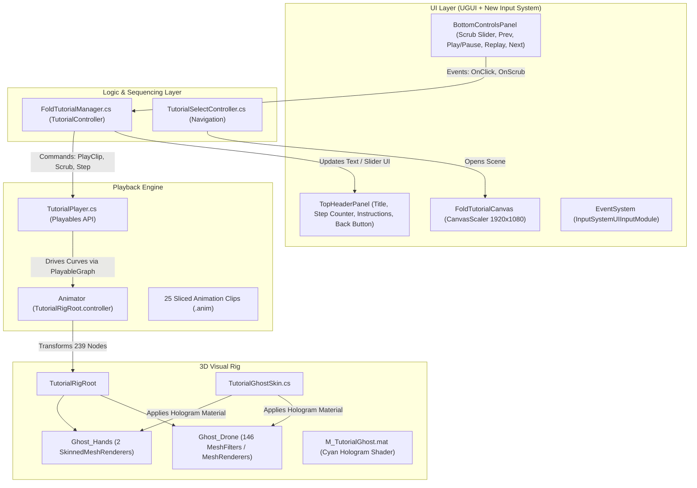

# Fold For Storage Tutorial Module

## 1. Overview & Purpose

The **Fold For Storage** screen (`Assets/Screens/FoldForStorageScreen/FoldForStorage.unity`) is an interactive 3D training module within the **MobileTrainer** application. Its objective is to teach learners the complete **26-step mechanical procedure** required to fold the Vega 2.0 industrial drone from its operational configuration into its compact transport/storage configuration.

Unlike static video tutorials or PDF manuals, this system provides:
* **True 3D Visualization**: Real-time rendering of drone sub-assemblies (arms, sliders, latches, landing gear legs, and propellers) moving in 3D space.
* **Synchronized Ghost Hands**: Animated human hands demonstrate natural grasp positions, pinch points, and push actions for every mechanism.
* **Interactive Control**: Step-by-step navigation, pause/play, replay, and bidirectional timeline scrubbing.
* **Mobile-First UX**: Responsive UI scaled for mobile screens with touch interaction handled through Unity’s New Input System.

---

## 2. System Architecture

The module is organized into five interconnected subsystems:

---

## 3. How the 3D Animation & Rig Work

### 3.1. The Animation Binding Principle
Unity animation clips (`.anim`) store transformation curves keyed to **GameObject hierarchy paths** (e.g. `Ghost_Drone/Body/Right_Arm/Latch`).
If any GameObject in the hierarchy is missing, renamed, or reparented, the curve binding breaks ("Missing Transform") and that part will freeze.

In this module:
* The animation curves were recorded and baked against a root called `TutorialRigRoot`.
* Under `TutorialRigRoot` there are **239 precisely named Transform nodes**, matching the paths expected by all 25 animation clips.
* The rig is split into five main branches:
  1. `Ghost_Drone`: Contains the central fuselage, arms, folding joints, body latches, and sliders.
  2. `Ghost_Battery_Upper`: The battery pack and its rotating release handle.
  3. `Ghost_Arm_BackRight`: Dedicated articulation branch for the rear folding arm.
  4. `Ghost_HandLeft`: Left hand bone hierarchy with an `XRHand_Wrist` joint tree driving a `SkinnedMeshRenderer`.
  5. `Ghost_HandRight`: Right hand bone hierarchy with an `XRHand_Wrist` joint tree driving a `SkinnedMeshRenderer`.

### 3.2. Geometry Attachments
* **Drone Geometry**: 146 sub-objects under `Ghost_Drone` and `Ghost_Battery_Upper` have `MeshFilter` and `MeshRenderer` components referencing submeshes of `Assets/DroneModel/VEGA 2.0 10062026.obj`.
* **Hand Geometry**: `LeftHand` and `RightHand` child objects have `SkinnedMeshRenderer` components referencing the skinned meshes from `LeftHand.fbx` and `RightHand.fbx`.

### 3.3. Hologram Ghost Skin (`TutorialGhostSkin.cs`)
To match the original holographic visualization style and avoid untextured/magenta artifacts:
* `TutorialGhostSkin.cs` is attached to `TutorialRigRoot`.
* On `Awake()` (or via the Inspector context menu `Apply Skin`), it traverses the renderers under the 5 ghost roots and assigns [`M_TutorialGhost.mat`](file:///Volumes/Baracuda/Unity/MobileTrainer/Assets/Materials/M_TutorialGhost.mat).
* `M_TutorialGhost.mat` uses the Universal Render Pipeline (URP) Lit shader configured for transparency (`_Surface = 1`, `_Blend = 0`) with an emission tint and a translucent cyan base color (`RGBA: 0.37, 0.91, 0.93, 0.51`).

---

## 4. The Playback Engine (`TutorialPlayer.cs`)

Instead of using a complex Animator state machine with hundreds of transitions, playback is powered dynamically using Unity’s **Playables API** (`UnityEngine.Animations.AnimationClipPlayable` and `UnityEngine.Playables.PlayableGraph`).

### Key Functions
* **`PlayClip(AnimationClip c, float trimStart = 0f, float trimEnd = 0f)`**:
  Destroys any existing graph, constructs a new `AnimationClipPlayable` connected directly to the `Animator` on `TutorialRigRoot`, sets playback limits, and begins playback.
* **`Scrub01(float f)`**:
  Immediately positions playback time to `t0 + f * (t1 - t0)` and forces `_graph.Evaluate(0f)` so the 3D meshes update synchronously with the user’s finger touch on the slider.
* **`TogglePlay()` / `Pause()` / `Play()`**:
  Controls graph speed (`SetSpeed(speed)` vs `SetSpeed(0)`) without destroying playback state.
* **`PlacementMode.DroneAnchored`**:
  Configures the player to leave `TutorialRigRoot` at the scene origin, allowing the camera to frame it cleanly for mobile screen space.

---

## 5. Step Sequencing (`FoldTutorialManager.cs`)

`FoldTutorialManager.cs` sits on the `TutorialController` GameObject and orchestrates the user tutorial flow.

### The 26 Fold Steps

| Step # | Title | Instruction Text | Animation Clip (.anim) |
| :---: | :--- | :--- | :--- |
| **1** | Release the battery | Grab the battery handle and rotate it until the latch releases. | `Release_Battery.anim` |
| **2** | Lift the battery off | Keep hold of the handle and lift the upper battery unit clear of the drone. | `Release_Battery.anim` |
| **3** | Set all fan blades | Rotate each of the eight fan blades into the folding range. | `set_fan_blades.anim` |
| **4** | Open the right body latch | Grab the right body latch and swing it fully open. | `open_body_right_latch.anim` |
| **5** | Slide the right body slider | Slide the right body slider back past its stop. | `slide_body_right_slider.anim` |
| **6** | Close the right body latch | Swing the right body latch shut to lock the slider. | `close_body_right_latch.anim` |
| **7** | Open the left body latch | Grab the left body latch and swing it fully open. | `open_body_left_latch.anim` |
| **8** | Slide the left body slider | Slide the left body slider back past its stop. | `slide_body_left_slider.anim` |
| **9** | Close the left body latch | Swing the left body latch shut to lock the slider. | `close_body_left_latch.anim` |
| **10** | Fold both halves | Grab both halves of the drone and rotate them inward together past 85 degrees. | `fold_both_body_arms.anim` |
| **11** | Open the front-right latch | Grab the front-right latch and swing it fully open. | `open_front_right_latch.anim` |
| **12** | Slide the front-right slider | Slide the front-right slider back past its stop. | `slide_front_right_slider.anim` |
| **13** | Close the front-right latch | Swing the front-right latch shut to lock the slider. | `close_front_right_latch.anim` |
| **14** | Open the front-left latch | Grab the front-left latch and swing it fully open. | `open_front_left_latch.anim` |
| **15** | Slide the front-left slider | Slide the front-left slider back past its stop. | `slide_front_left_slider.anim` |
| **16** | Close the front-left latch | Swing the front-left latch shut to lock the slider. | `close_front_left_latch.anim` |
| **17** | Fold the front arms | Grab both front sub-arms and rotate them together past 90 degrees. | `fold_both_front_subarms.anim` |
| **18** | Open the back-right latch | Grab the back-right latch and swing it fully open. | `open_back_right_latch.anim` |
| **19** | Slide the back-right slider | Slide the back-right slider back past its stop. | `slide_back_right_slider.anim` |
| **20** | Close the back-right latch | Swing the back-right latch shut to lock the slider. | `close_back_right_latch.anim` |
| **21** | Open the back-left latch | Grab the back-left latch and swing it fully open. | `open_back_left_latch.anim` |
| **22** | Slide the back-left slider | Slide the back-left slider back past its stop. | `slide_back_left_slider.anim` |
| **23** | Close the back-left latch | Swing the back-left latch shut to lock the slider. | `close_back_left_latch.anim` |
| **24** | Fold the back arms | Grab both rear sub-arms and rotate them together past 90 degrees. | `fold_both_back_subarms.anim` |
| **25** | Fold one landing gear | Poke the button on each leg of either landing gear, then fold both of its legs past 85 degrees. | `fold_one_pair_landing_gear.anim` |
| **26** | Fold the other landing gear | Do the same on the remaining landing gear: poke each leg button, then fold both legs. | `fold_another_pair_landing_gear.anim` |

### Step Transition Logic (`GoToStep(int stepIndex)`)
1. Clamps `stepIndex` within `[0, steps.Count - 1]`.
2. Updates `stepCounterText` to `STEP {stepIndex + 1} / {steps.Count}`.
3. Updates `titleText` and `instructionText` with step details.
4. Enables/disables `prevButton` and `nextButton` at sequence boundaries (Step 1 disables `PREV`, Step 26 disables `NEXT`).
5. Calls `player.PlayClip(step.clip)` with step-specific trim timing.
6. Resets timeline slider to 0.

### Bidirectional Timeline Scrubbing
* While playing, `FoldTutorialManager.Update()` continuously reads `player.Progress01` and sets `timelineSlider.SetValueWithoutNotify(progress)`.
* When the user touches the slider, `EventTrigger` triggers `OnSliderPointerDown()`, setting `isScrubbing = true` to prevent playback from fighting touch input.
* On dragging, `OnSliderScrub(float val)` feeds the normalized float directly into `player.Scrub01(val)`.
* On release, `OnSliderPointerUp()` clears `isScrubbing = false` and playback resumes smoothly.

---

## 6. Mobile UI & Input Handling

* **Canvas Scaler**: Configured to `Scale With Screen Size` at reference resolution `1920 x 1080` with a 0.5 Width/Height match weight, ensuring proper layout across phones, foldables, and tablets.
* **Header Bar (`TopHeaderPanel`)**:
  * Anchored to the top 18% of the viewport.
  * Contains a Back button (returns to `TutorialSelectScreen`), the current Step Counter badge, bold Step Title, and descriptive instruction text.
* **Bottom Bar (`BottomControlsPanel`)**:
  * Anchored to the bottom 18% of the viewport.
  * Houses the timeline slider and a row of four buttons: `[PREV]`, `[PLAY/PAUSE]`, `[REPLAY]`, and `[NEXT]`.
* **New Input System (`InputSystemUIInputModule`)**:
  * Replaces legacy `StandaloneInputModule` to comply with MobileTrainer’s Player Settings (`Active Input Handling = Input System Package (New)`).
  * Uses `InputSystem_Actions.inputactions` to support touch taps, drags, mouse clicks, and pen input without throwing `InvalidOperationException`.

---

## 7. Scene Automation & Maintenance Tools (`FoldSceneSetup.cs`)

An editor utility is located at `Assets/Screens/FoldForStorageScreen/Editor/FoldSceneSetup.cs`.

### Menu Items in Unity
* **`Tools -> Setup Fold For Storage Scene`**:
  * Ensures the `FoldForStorage.unity` scene is open.
  * Verifies `TutorialRigRoot`, sets up `TutorialPlayer` and `TutorialGhostSkin`.
  * Creates or updates the camera, directional lighting, and `EventSystem`.
  * Builds the responsive UI hierarchy and binds all button/slider events to `FoldTutorialManager`.
  * Automatically populates all 26 step definitions and saves the scene.
* **`Tools -> Wire Tutorial Select Screen Buttons`**:
  * Opens `TutorialSelectScreen.unity`.
  * Finds the `FOLD FOR STORAGE` and `DEPLOY FOR FLIGHT` buttons (LeanButton).
  * Wires their click events to `TutorialSelectController.OpenFoldForStorage()` and `TutorialSelectController.OpenDeployForFlight()`.
  * Saves the scene.

---

## 8. File & Asset Inventory

| File Path | Description |
| :--- | :--- |
| `Assets/Screens/FoldForStorageScreen/FoldForStorage.unity` | The main folding tutorial scene. |
| `Assets/Screens/FoldForStorageScreen/Scripts/FoldTutorialManager.cs` | Sequencer managing 26 steps, slider sync, and UI buttons. |
| `Assets/Screens/FoldForStorageScreen/Scripts/TutorialPlayer.cs` | Low-level clip player using Playables API for smooth scrubbing and looping. |
| `Assets/Screens/FoldForStorageScreen/Scripts/TutorialGhostSkin.cs` | Assigns hologram materials across all rig and hand renderers. |
| `Assets/Screens/FoldForStorageScreen/Editor/FoldSceneSetup.cs` | Editor automation script for scene generation and button wiring. |
| `Assets/Screens/FoldForStorageScreen/Anim/*.anim` | 25 sliced animation clips corresponding to each folding step. |
| `Assets/Screens/FoldForStorageScreen/Anim/TutorialRigRoot.controller` | Animator controller binding clips to the rig. |
| `Assets/DroneModel/VEGA 2.0 10062026.obj` | 3D drone mesh file referenced by the 146 rig MeshFilters. |
| `Assets/DroneModel/Hands/LeftHand.fbx` & `RightHand.fbx` | 3D hand models referenced by the SkinnedMeshRenderers. |
| `Assets/Materials/M_TutorialGhost.mat` | Translucent cyan holographic material applied to ghosts. |
| `Assets/Screens/TutorialSelectScreen/TutorialSelectController.cs` | Handles scene transitions from the select menu. |
| `ProjectSettings/EditorBuildSettings.asset` | Build settings registering `FoldForStorage.unity` in the build index. |
