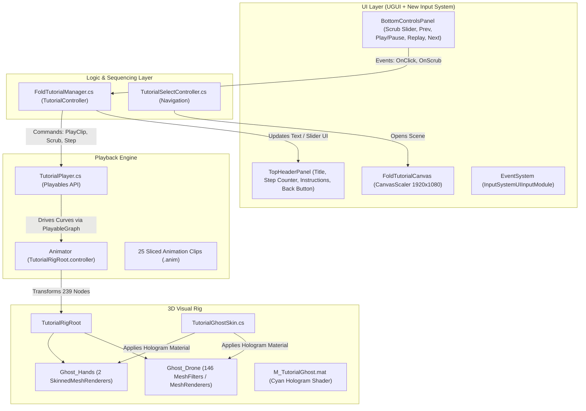

# Fold For Storage Tutorial Module

## 1. Overview & Purpose

The **Fold For Storage** screen (`Assets/Screens/FoldForStorageScreen/FoldForStorage.unity`) is an interactive 3D training module within the **MobileTrainer** application. Its objective is to teach learners the complete **25-step mechanical procedure** required to fold the Vega 2.0 industrial drone from its operational configuration into its compact transport/storage configuration.

Unlike static video tutorials or PDF manuals, this system provides:
* **True 3D Visualization**: Real-time rendering of drone sub-assemblies (arms, sliders, latches, landing gear legs, and propellers) moving in 3D space.
* **Synchronized Ghost Hands**: Animated human hands demonstrate natural grasp positions, pinch points, and push actions for every mechanism.
* **Interactive Control**: Step-by-step navigation, pause/play, replay, and bidirectional timeline scrubbing.
* **Mobile-First UX**: Responsive UI scaled for mobile screens with touch interaction handled through Unity’s New Input System.

---

## 2. System Architecture

The module is organized into five interconnected subsystems:



### 2.1. Core Script Attachment & Host GameObjects

In the scene [`FoldForStorage.unity`](file:///Volumes/Baracuda/Unity/MobileTrainer/Assets/Screens/FoldForStorageScreen/FoldForStorage.unity), the three core scripts are attached to specific root-level GameObjects:

| Script | Host GameObject | Hierarchy Location | Purpose |
| :--- | :--- | :--- | :--- |
| [`FoldTutorialManager.cs`](file:///Volumes/Baracuda/Unity/MobileTrainer/Assets/Screens/FoldForStorageScreen/Scripts/FoldTutorialManager.cs) | **`TutorialController`** | Root level | High-level sequencer managing 25 steps, UI text updates, slider scrubbing, and Next/Prev/Back button events. |
| [`TutorialPlayer.cs`](file:///Volumes/Baracuda/Unity/MobileTrainer/Assets/Screens/FoldForStorageScreen/Scripts/TutorialPlayer.cs) | **`TutorialRigRoot`** | Root level | Low-level playback engine using Unity's Playables API to directly drive the `Animator` component with step clips. |
| [`TutorialGhostSkin.cs`](file:///Volumes/Baracuda/Unity/MobileTrainer/Assets/Screens/FoldForStorageScreen/Scripts/TutorialGhostSkin.cs) | **`TutorialRigRoot`** | Root level | Traverses all 5 child ghost branches under `TutorialRigRoot` on `Awake()` and applies `M_TutorialGhost.mat` to all renderers. |
| [`SliderEventBridge.cs`](file:///Volumes/Baracuda/Unity/MobileTrainer/Assets/Screens/FoldForStorageScreen/Scripts/SliderEventBridge.cs) | **`TimelineSlider`** | `Canvas/BottomControlsPanel` | Intercepts pointer events, manages 70px touch hit target, and drives instant jump-to-point and drag scrubbing. |

---

## 3. How the 3D Animation & Rig Work

### 3.1. The Animation Binding Principle
Unity animation clips (`.anim`) store transformation curves keyed to **GameObject hierarchy paths** (e.g. `Ghost_Drone/Body/Right_Arm/Latch`).
If any GameObject in the hierarchy is missing, renamed, or reparented, the curve binding breaks ("Missing Transform") and that part will freeze.

In this module:
* The animation curves were recorded and baked against a root called `TutorialRigRoot`.
* Under `TutorialRigRoot` there are **239 precisely named Transform nodes**, matching the paths expected by all 25 animation clips.
* The rig is split into five main branches:
  1. `Ghost_Drone`: Contains the central fuselage, arms, folding joints, body latches, and sliders.
  2. `Ghost_Battery_Upper`: The battery pack and its rotating release handle.
  3. `Ghost_Arm_BackRight`: Dedicated articulation branch for the rear folding arm.
  4. `Ghost_HandLeft`: Left hand bone hierarchy with an `XRHand_Wrist` joint tree driving a `SkinnedMeshRenderer`.
  5. `Ghost_HandRight`: Right hand bone hierarchy with an `XRHand_Wrist` joint tree driving a `SkinnedMeshRenderer`.

### 3.2. Geometry Attachments
* **Drone Geometry**: 146 sub-objects under `Ghost_Drone` and `Ghost_Battery_Upper` have `MeshFilter` and `MeshRenderer` components referencing submeshes of `Assets/Screens/FoldForStorageScreen/Models/VEGA 2.0 10062026.obj`.
* **Hand Geometry**: `LeftHand` and `RightHand` child objects have `SkinnedMeshRenderer` components referencing the skinned meshes from `LeftHand.fbx` and `RightHand.fbx` under `Assets/Screens/FoldForStorageScreen/Models/Hands/`.

### 3.3. Multi-Theme Ghost Skin & Build Switcher (`TutorialGhostSkin.cs`)
To support multiple presentation and testing styles requested by instructors, the drone and hands support **3 distinct visual themes** that can be switched with 1 click:

| Version | Drone Skin Material | Active Part Highlight Material | Ghost Hands Material |
| :--- | :--- | :--- | :--- |
| **Version 1 (Default)** | `M_TutorialGhost.mat` (Cyan) | `M_TutorialGhost_Red.mat` (Red Emission) | `M_TutorialGhost.mat` (Cyan) |
| **Version 2** | `CarbonFiber.mat` (Carbon Fiber) | `M_TutorialGhost_Yellow.mat` (Yellow Emission) | `M_TutorialGhost.mat` (Cyan) |
| **Version 3** | `CarbonFiber.mat` (Carbon Fiber) | `M_TutorialGhost.mat` (Cyan Hologram) | `M_TutorialGhost.mat` (Cyan) |

#### How to Switch Between the 3 Versions:
1. **Unity Top Menu Bar (1-Click)**:
   Navigate to `Tools > Fold Tutorial Theme`:
   - `Version 1: Cyan Ghost + Red Highlight`
   - `Version 2: Carbon Fiber + Yellow Highlight`
   - `Version 3: Carbon Fiber + Cyan Highlight`
   *(Automatically sets materials, skins the rig, and saves the scene ready for build)*.
2. **Inspector Quick-Switch Buttons**:
   Select `TutorialRigRoot` in the Hierarchy. The custom Inspector for `TutorialGhostSkin` features 3 large color-coded buttons at the top to toggle between the 3 versions instantly.
3. **Play Mode Live Hotkeys**:
   During Play mode or in development builds, press **`1`**, **`2`**, or **`3`** on your keyboard to instantly swap themes in real time, with the current step highlight updating synchronously.
4. **Batch Building All 3 APKs**:
   Run `Tools > Fold Tutorial Theme > Batch Build All 3 APKs...` to automatically compile 3 separate APKs (`MobileTrainer_v1_CyanGhost_RedHighlight.apk`, `MobileTrainer_v2_CarbonFiber_YellowHighlight.apk`, `MobileTrainer_v3_CarbonFiber_CyanHighlight.apk`) into your chosen output folder.

---

## 4. The Playback Engine (`TutorialPlayer.cs`)

Instead of using a complex Animator state machine with hundreds of transitions, playback is powered dynamically using Unity’s **Playables API** (`UnityEngine.Animations.AnimationClipPlayable` and `UnityEngine.Playables.PlayableGraph`).

### Key Functions
* **`PlayClip(AnimationClip c, float trimStart = 0f, float trimEnd = 0f)`**:
  Destroys any existing graph, constructs a new `AnimationClipPlayable` connected directly to the `Animator` on `TutorialRigRoot`, sets playback limits, and begins playback.
* **`Scrub01(float f)`**:
  Immediately positions playback time to `t0 + f * (t1 - t0)` and forces `_graph.Evaluate(0f)` so the 3D meshes update synchronously with the user’s finger touch on the slider.
* **`TogglePlay()` / `Pause()` / `Play()`**:
  Controls graph speed (`SetSpeed(speed)` vs `SetSpeed(0)`) without destroying playback state.
* **`PlacementMode.DroneAnchored`**:
  Configures the player to leave `TutorialRigRoot` at the scene origin, allowing the camera to frame it cleanly for mobile screen space.

---

## 5. Step Sequencing (`FoldTutorialManager.cs`)

`FoldTutorialManager.cs` sits on the `TutorialController` GameObject and orchestrates the user tutorial flow.

### The 25 Fold Steps

| Step # | Title | Instruction Text | Animation Clip (.anim) |
| :---: | :--- | :--- | :--- |
| **1** | Lift the battery off | Keep hold of the handle and lift the upper battery unit clear of the drone. | `Release_Battery.anim` |
| **2** | Set all fan blades | Rotate each of the eight fan blades into the folding range. | `set_fan_blades.anim` |
| **3** | Open the right body latch | Grab the right body latch and swing it fully open. | `open_body_right_latch.anim` |
| **4** | Slide the right body slider | Slide the right body slider back past its stop. | `slide_body_right_slider.anim` |
| **5** | Close the right body latch | Swing the right body latch shut to lock the slider. | `close_body_right_latch.anim` |
| **6** | Open the left body latch | Grab the left body latch and swing it fully open. | `open_body_left_latch.anim` |
| **7** | Slide the left body slider | Slide the left body slider back past its stop. | `slide_body_left_slider.anim` |
| **8** | Close the left body latch | Swing the left body latch shut to lock the slider. | `close_body_left_latch.anim` |
| **9** | Fold both halves | Grab both halves of the drone and rotate them inward together past 85 degrees. | `fold_both_body_arms.anim` |
| **10** | Open the front-right latch | Grab the front-right latch and swing it fully open. | `open_front_right_latch.anim` |
| **11** | Slide the front-right slider | Slide the front-right slider back past its stop. | `slide_front_right_slider.anim` |
| **12** | Close the front-right latch | Swing the front-right latch shut to lock the slider. | `close_front_right_latch.anim` |
| **13** | Open the front-left latch | Grab the front-left latch and swing it fully open. | `open_front_left_latch.anim` |
| **14** | Slide the front-left slider | Slide the front-left slider back past its stop. | `slide_front_left_slider.anim` |
| **15** | Close the front-left latch | Swing the front-left latch shut to lock the slider. | `close_front_left_latch.anim` |
| **16** | Fold the front arms | Grab both front sub-arms and rotate them together past 90 degrees. | `fold_both_front_subarms.anim` |
| **17** | Open the back-right latch | Grab the back-right latch and swing it fully open. | `open_back_right_latch.anim` |
| **18** | Slide the back-right slider | Slide the back-right slider back past its stop. | `slide_back_right_slider.anim` |
| **19** | Close the back-right latch | Swing the back-right latch shut to lock the slider. | `close_back_right_latch.anim` |
| **20** | Open the back-left latch | Grab the back-left latch and swing it fully open. | `open_back_left_latch.anim` |
| **21** | Slide the back-left slider | Slide the back-left slider back past its stop. | `slide_back_left_slider.anim` |
| **22** | Close the back-left latch | Swing the back-left latch shut to lock the slider. | `close_back_left_latch.anim` |
| **23** | Fold the back arms | Grab both rear sub-arms and rotate them together past 90 degrees. | `fold_both_back_subarms.anim` |
| **24** | Fold one landing gear | Poke the button on each leg of either landing gear, then fold both of its legs past 85 degrees. | `fold_one_pair_landing_gear.anim` |
| **25** | Fold the other landing gear | Do the same on the remaining landing gear: poke each leg button, then fold both legs. | `fold_another_pair_landing_gear.anim` |

### Step Transition Logic (`GoToStep(int stepIndex)`)
1. Clamps `stepIndex` within `[0, steps.Count - 1]`.
2. Updates `stepCounterText` to `STEP {stepIndex + 1} / {steps.Count}`.
3. Updates `titleText` and `instructionText` with step details.
4. Enables/disables `prevButton` and `nextButton` at sequence boundaries (Step 1 disables `PREV`, Step 25 disables `NEXT`).
5. Calls `player.PlayClip(step.clip)` with step-specific trim timing.
6. Resets timeline slider to 0.

### Bidirectional Timeline Scrubbing
* While playing, `FoldTutorialManager.Update()` continuously reads `player.Progress01` and sets `timelineSlider.SetValueWithoutNotify(progress)`.
* When the user touches the slider, `EventTrigger` triggers `OnSliderPointerDown()`, setting `isScrubbing = true` to prevent playback from fighting touch input.
* On dragging, `OnSliderScrub(float val)` feeds the normalized float directly into `player.Scrub01(val)`.
* On release, `OnSliderPointerUp()` clears `isScrubbing = false` and playback resumes smoothly.

---

## 6. Mobile UI & Input Handling

* **Canvas Scaler**: Configured to `Scale With Screen Size` at reference resolution `1920 x 1080` with a 0.5 Width/Height match weight, ensuring proper layout across phones, foldables, and tablets.
* **Header Bar (`TopHeaderPanel`)**:
  * Anchored to the top 18% of the viewport.
  * Contains a Back button (returns to `TutorialSelectScreen`), the current Step Counter badge, bold Step Title, and descriptive instruction text.
* **Bottom Bar (`BottomControlsPanel`)**:
  * Anchored to the bottom 18% of the viewport.
  * Houses the timeline slider and a row of four buttons: `[PREV]`, `[PLAY/PAUSE]`, `[REPLAY]`, and `[NEXT]`.
* **New Input System (`InputSystemUIInputModule`)**:
  * Replaces legacy `StandaloneInputModule` to comply with MobileTrainer’s Player Settings (`Active Input Handling = Input System Package (New)`).
  * Uses `InputSystem_Actions.inputactions` to support touch taps, drags, mouse clicks, and pen input without throwing `InvalidOperationException`.

---

## 7. Scene Automation & Maintenance Tools (`FoldSceneSetup.cs`)

An editor utility is located at `Assets/Screens/FoldForStorageScreen/Editor/FoldSceneSetup.cs`.

### Menu Items in Unity
* **`Tools -> Setup Fold For Storage Scene`**:
  * Ensures the `FoldForStorage.unity` scene is open.
  * Verifies `TutorialRigRoot`, sets up `TutorialPlayer` and `TutorialGhostSkin`.
  * Creates or updates the camera, directional lighting, and `EventSystem`.
  * Builds the responsive UI hierarchy and binds all button/slider events to `FoldTutorialManager`.
  * Automatically populates all 25 step definitions and saves the scene.
* **`Tools -> Wire Tutorial Select Screen Buttons`**:
  * Opens `TutorialSelectScreen.unity`.
  * Finds the `FOLD FOR STORAGE` and `DEPLOY FOR FLIGHT` buttons (LeanButton).
  * Wires their click events to `TutorialSelectController.OpenFoldForStorage()` and `TutorialSelectController.OpenDeployForFlight()`.
  * Saves the scene.

---

## 8. File & Asset Inventory

| File Path | Description |
| :--- | :--- |
| `Assets/Screens/FoldForStorageScreen/FoldForStorage.unity` | The main folding tutorial scene. |
| `Assets/Screens/FoldForStorageScreen/Scripts/FoldTutorialManager.cs` | Sequencer managing 25 steps, slider sync, and UI buttons. |
| `Assets/Screens/FoldForStorageScreen/Scripts/TutorialPlayer.cs` | Low-level clip player using Playables API for smooth scrubbing and looping. |
| `Assets/Screens/FoldForStorageScreen/Scripts/TutorialGhostSkin.cs` | Assigns hologram materials across all rig and hand renderers. |
| `Assets/Screens/FoldForStorageScreen/Scripts/SliderEventBridge.cs` | Bridges slider pointer events, provisions invisible 70px hit target, and handles instant jumps. |
| `Assets/Screens/FoldForStorageScreen/Editor/FoldSceneSetup.cs` | Editor automation script for scene generation and button wiring. |
| `Assets/Screens/FoldForStorageScreen/Anim/*.anim` | 25 sliced animation clips corresponding to each folding step. |
| `Assets/Screens/FoldForStorageScreen/Anim/TutorialRigRoot.controller` | Animator controller binding clips to the rig. |
| `Assets/Screens/FoldForStorageScreen/Models/VEGA 2.0 10062026.obj` | 3D drone mesh file referenced by the 146 rig MeshFilters. |
| `Assets/Screens/FoldForStorageScreen/Models/Hands/LeftHand.fbx` & `RightHand.fbx` | 3D hand models referenced by the SkinnedMeshRenderers. |
| `Assets/Screens/FoldForStorageScreen/Materials/M_TutorialGhost.mat` | Translucent cyan holographic material applied to ghosts. |
| `Assets/Screens/TutorialSelectScreen/TutorialSelectController.cs` | Handles scene transitions from the select menu. |
| `ProjectSettings/EditorBuildSettings.asset` | Build settings registering `FoldForStorage.unity` in the build index. |

---

## 9. File Migration & Relocation Mapping (From Where to Where)

To ensure the **Fold For Storage** module is completely self-contained and modular (allowing it to be exported as a `.unitypackage` or moved without external dangling dependencies), all tutorial-specific 3D models, hands, materials, and textures were relocated from root `Assets/` into dedicated subdirectories within `Assets/Screens/FoldForStorageScreen/`.

> [!IMPORTANT]
> **GUID & Reference Preservation**:
> In Unity, assets are bound across scenes, prefabs, and materials by their 128-bit GUID stored in each file's corresponding `.meta` file.
> During relocation, every asset file was moved simultaneously with its `.meta` file (e.g., `mv <file> <dest>` and `mv <file>.meta <dest>`). This preserved 100% of internal GUIDs, guaranteeing that:
> * All 111 submesh filter references in `FoldForStorage.unity` remained attached to `VEGA 2.0 10062026.obj`.
> * Hand `SkinnedMeshRenderer` components remained attached to `LeftHand.fbx` and `RightHand.fbx`.
> * All 149 renderer material bindings and `TutorialGhostSkin.hologramMaterial` remained attached to `M_TutorialGhost.mat`.
> * Material texture map channels (normal, metallic, roughness, AO) remained attached to their respective texture files.

### 9.1. Migration Inventory (Source $\rightarrow$ Destination)

| Original Source Path | New Destination Path | Category | Description |
| :--- | :--- | :--- | :--- |
| `Assets/DroneModel/VEGA 2.0 10062026.obj` | `Assets/Screens/FoldForStorageScreen/Models/VEGA 2.0 10062026.obj` | 3D Mesh | Main 1.9 GB drone mesh containing all submeshes for the 146 rig nodes. |
| `Assets/DroneModel/VEGA 2.0 10062026.mtl` | `Assets/Screens/FoldForStorageScreen/Models/VEGA 2.0 10062026.mtl` | Material Def | Wavefront material definitions accompanying the OBJ drone model. |
| `Assets/DroneModel/Hands/LeftHand.fbx` | `Assets/Screens/FoldForStorageScreen/Models/Hands/LeftHand.fbx` | 3D Rig | Skinned left human hand model and bone hierarchy. |
| `Assets/DroneModel/Hands/RightHand.fbx` | `Assets/Screens/FoldForStorageScreen/Models/Hands/RightHand.fbx` | 3D Rig | Skinned right human hand model and bone hierarchy. |
| `Assets/DroneModel/Hands/LeftHandAndroidXR.fbx` | `Assets/Screens/FoldForStorageScreen/Models/Hands/LeftHandAndroidXR.fbx` | 3D Rig | Alternate Android XR left hand model. |
| `Assets/DroneModel/Hands/RightHandAndroidXR.fbx` | `Assets/Screens/FoldForStorageScreen/Models/Hands/RightHandAndroidXR.fbx` | 3D Rig | Alternate Android XR right hand model. |
| `Assets/Materials/M_TutorialGhost.mat` | `Assets/Screens/FoldForStorageScreen/Materials/M_TutorialGhost.mat` | Material | URP Lit translucent cyan holographic material (`RGBA: 0.37, 0.91, 0.93, 0.51`). |
| `Assets/Materials/CarbonFiber.mat` | `Assets/Screens/FoldForStorageScreen/Materials/CarbonFiber.mat` | Material | Carbon fiber surface material mapped to texture normal/metallic maps. |
| `Assets/Materials/twisted_metal_wire.mat` | `Assets/Screens/FoldForStorageScreen/Materials/twisted_metal_wire.mat` | Material | Wire bundle material mapped to 2K metallic/roughness textures. |
| `Assets/Materials/Matte_Black.mat` | `Assets/Screens/FoldForStorageScreen/Materials/Matte_Black.mat` | Material | Fuselage matte black URP Lit material. |
| `Assets/Materials/Shiny_Black.mat` | `Assets/Screens/FoldForStorageScreen/Materials/Shiny_Black.mat` | Material | Glossy black accent material. |
| `Assets/Materials/Steel.mat` | `Assets/Screens/FoldForStorageScreen/Materials/Steel.mat` | Material | Metallic steel latch, pin, and hinge material. |
| `Assets/Materials/Blue.mat` | `Assets/Screens/FoldForStorageScreen/Materials/Blue.mat` | Material | Blue connector/highlight material. |
| `Assets/Materials/Red.mat` | `Assets/Screens/FoldForStorageScreen/Materials/Red.mat` | Material | Red safety latch highlight material. |
| `Assets/Materials/Golden.mat` | `Assets/Screens/FoldForStorageScreen/Materials/Golden.mat` | Material | Gold connector terminal material. |
| `Assets/Materials/Grey.mat` | `Assets/Screens/FoldForStorageScreen/Materials/Grey.mat` | Material | Neutral grey structural material. |
| `Assets/Materials/Yellow.mat` | `Assets/Screens/FoldForStorageScreen/Materials/Yellow.mat` | Material | High-visibility yellow caution material. |
| `Assets/Textures/carbon-fiber-unity/*` | `Assets/Screens/FoldForStorageScreen/Textures/carbon-fiber-unity/*` | Textures | Normal map, metallic map, height map, AO map, and albedo textures. |
| `Assets/Textures/twisted_metallic_wire/*` | `Assets/Screens/FoldForStorageScreen/Textures/twisted_metallic_wire/*` | Textures | 2K albedo, normal direct/openGL, metallic, roughness, and AO textures. |
| *(External / Master Slices)* | `Assets/Screens/FoldForStorageScreen/Anim/*.anim` | Animations | 25 sliced step clips + `set_fan_blades.anim` brought into the module anim folder. |

### 9.2. Script Code Constants Updated

Following the asset relocation, code path constants in editor tooling were updated:

* **[`FoldSceneSetup.cs`](file:///Volumes/Baracuda/Unity/MobileTrainer/Assets/Screens/FoldForStorageScreen/Editor/FoldSceneSetup.cs#L20)**:
  * **Before**: `private const string GhostMatPath = "Assets/Materials/M_TutorialGhost.mat";`
  * **After**: `private const string GhostMatPath = "Assets/Screens/FoldForStorageScreen/Materials/M_TutorialGhost.mat";`

---

## 10. Timeline Scrubbing & Touch Jump Diagnostics & Solutions

During mobile testing, two critical issues affected the timeline slider (`TimelineSlider`):

1. **Scrub Stutter & PlayableGraph Evaluation Conflict**:
   * Dragging the slider handle felt unresponsive, jittery, or froze video playback entirely.
2. **Missed Touch Jumps along Track**:
   * Tapping along the slider to jump to specific timestamps frequently missed touches, with only ~10-20% of taps registering.

### 10.1. Issue 1: Timeline Slider Drag Conflicts & PlayableGraph Crash

#### Root Cause:
* **Frame-by-Frame Update Fighting User Input**: In `FoldTutorialManager.cs`, `Update()` unconditionally executed `timelineSlider.SetValueWithoutNotify(player.Progress01)` every frame. When the user attempted to drag or scrub, `Update()` immediately overwrote the slider handle position back to the playing clip timestamp, causing the slider to fight the user's touch.
* **PlayableGraph Evaluation Exception**: Calling `_graph.Evaluate(0f)` in `TutorialPlayer.Scrub01()` while the graph was playing in `DirectorUpdateMode.GameTime` threw:
  ```text
  InvalidOperationException: PlayableGraph.Evaluate is not allowed when the graph is playing.
  ```
  This unhandled exception broke the scrub event pipeline, preventing further scrubbing updates.

#### Solution:
* **State-Aware Scrubbing Lifecycle (`FoldTutorialManager.cs`)**:
  * Added `isScrubbing` and `wasPlayingBeforeScrub` tracking flags.
  * In `Update()`, slider position is only synchronized from playback when `!isScrubbing`.
  * On `OnSliderPointerDown()`, `wasPlayingBeforeScrub` records whether the clip was actively playing, and `player.Pause()` is called.
  * On `OnSliderPointerUp()`, `isScrubbing` is cleared, the final scrub position is flushed to `player.Scrub01()`, and playback automatically resumes if and only if it was playing beforehand (`if (wasPlayingBeforeScrub) player.Play()`).
* **Exception-Free Scrubbing (`TutorialPlayer.cs`)**:
  * Updated `Scrub01(float f)` to check `_graph.IsPlaying()`. If playing, it stops the graph before evaluating `_graph.Evaluate(0f)`, and only resumes if `_playing` remains true.
  * Ensures safe frame evaluation without throwing `InvalidOperationException`.

---

### 10.2. Issue 2: Missed Taps & Jumping Touches Along the Slider Track

#### Root Cause:
* **Microscopic 15-Pixel Hit Target**:
  * In `FoldForStorage.unity`, the `TimelineSlider` GameObject has a RectTransform size of `1400 x 30` but possesses **no `Graphic` / `Image` component** on its root.
  * The only raycast targets along the track were the `Background` and `Fill` child images, which have vertical anchors `anchorMin.y = 0.25` and `anchorMax.y = 0.75` inside the 30px container—yielding an active clickable strip **only 15 pixels tall** ($Y = -7.5$ to $+7.5$).
  * On a 1080p mobile screen (`1920 x 1080`), a 15-pixel strip is **under 1 millimeter tall**.
  * A human fingertip touch contacts approximately 7–10 mm (~40–60 screen pixels). Any tap landing more than 7.5 pixels off the center line missed the slider track completely.
* **Touch Absorption by Background Panel**:
  * The slider resides inside `BottomControlsPanel`. `BottomControlsPanel` has an opaque image with `raycastTarget = true` and no slider event handlers.
  * When a touch missed the 15px strip, the raycast fell through to `BottomControlsPanel`, which swallowed the event without passing it to `TimelineSlider`, silently dropping the jump touch.
* **Dragging vs. Jumping Asymmetry**:
  * Dragging succeeded because users typically touched the 28x28 handle knob first. Once touched, Unity's EventSystem locked `eventData.pointerDrag` to `TimelineSlider`, maintaining tracking even if the finger drifted vertically. Jumping required hitting the invisible 15px strip directly, causing frequent missed touches.

#### Solution:
* **Dedicated Slider Event Bridge (`SliderEventBridge.cs`)**:
  * Attached directly to `TimelineSlider`. Implements `IPointerDownHandler`, `IPointerUpHandler`, `IDragHandler`, and `IPointerClickHandler`.
  * Integrates with `FoldTutorialManager` to coordinate scrub start, progress updates, and release states.
* **Runtime Non-Destructive Touch Hit Target (`TouchHitArea`)**:
  * Automatically provisions an invisible child GameObject (`TouchHitArea`) under `timelineSlider` at runtime on `Awake()` / `Start()`:
    * **RectTransform**: `anchorMin = (0f, 0.5f)`, `anchorMax = (1f, 0.5f)`, `pivot = (0.5f, 0.5f)`, `anchoredPosition = Vector2.zero`.
    * **Size**: `sizeDelta = (40f, 70f)` (height 70px, plus 20px horizontal margin at each end).
    * **Graphic**: `Image` with `color = new Color(0, 0, 0, 0)` (100% transparent) and `raycastTarget = true`.
    * **Hierarchy**: Placed as the first sibling (`SetAsFirstSibling()`) behind the visible 15px bar and handle knob.
  * Increases the touch hit target height from **15 pixels to 70 pixels (over 4.6x larger)**.
  * Completely non-destructive: **0 changes to `FoldForStorage.unity` scene assets**, and **0 changes to visual appearance or styling**.
* **Instant Exact Coordinate Jump**:
  * `JumpToPoint(PointerEventData eventData)` projects the screen touch point into the local coordinates of the handle container (`Handle Slide Area`):
    $$\text{normalized} = \text{clamp01}\left(\frac{\text{localPoint.x} - \text{container.rect.xMin}}{\text{container.rect.width}}\right)$$
  * Maps touch position 1:1 with handle knob travel limits, ensuring the handle knob instantly snaps directly under the user's finger.
  * Includes robust camera resolution supporting Screen Space Overlay, Screen Space Camera, and World Space canvases.

---

## 11. Per-Step & Scene-Default Camera Positioning System

To ensure optimal viewing angles for every mechanical sub-assembly across the tutorial, the system features a dedicated **Per-Step Camera Positioning and Reset Framework** (`StepCameraPose.cs`, `ModelCameraController.cs`, `TutorialStepCameraEditor.cs`).

### 11.1. Core Behavior
* **Per-Step Starting Camera Position**:
  * Each step in `steps` can store its own customized camera pose (`StepCameraPose`).
  * When navigating between steps (`GoToStep`, `NextStep`, `PreviousStep`), the camera smoothly glides to that step's custom starting pose over 0.45s using ease-in-out interpolation.
  * On initial scene load (`Step 0`), the camera initializes immediately at that pose without any jarring animation.
* **Scene Default Camera Position**:
  * If a step does not have a custom camera pose enabled, the camera automatically uses the `sceneDefaultPose`.
  * The scene default pose can also be captured or customized in 1 click in the editor.
* **Interactive Reset Button**:
  * When the user touches, rotates, pans, or zooms the camera to inspect the model and then presses the **RESET** button (top header bar), the camera smoothly animates back to the starting camera position of the **currently active step** (or the scene default).
  * If the user touches or drags the screen during any camera animation, input immediately interrupts the animation for zero-lag manual control.

### 11.2. How to Set Camera Positions Easily in the Editor
Three effortless workflows are supported:

1. **Step Camera Setup Assistant Toolbar (Inspector Top Bar)**:
   * Select `TutorialController` in the hierarchy. At the top of `FoldTutorialManager`, the **Step Camera Setup Assistant** box provides:
     * Step scrubber and `[◄ Prev]` / `[Next ►]` buttons.
     * **`[📸 Capture SceneView to Step X]`**: Instantly captures the orientation, framing, pivot, and distance of your current SceneView camera into the step.
     * **`[👁️ Preview Step Camera]`**: Aligns both the SceneView and Main Camera in the scene to that step's exact pose.
     * **`[🎯 Frame Step Target in View]`**: Automatically frames the mechanical part highlighted in that step in the SceneView.
     * **`[Capture SceneView as Default]`**: Sets the scene-wide default camera pose.
2. **Inline Step Property Drawer (Steps List)**:
   * Inside the `steps` list in the Inspector, each step includes a **`Use Custom Camera Position`** toggle:
     * Click **`[Capture View]`** to capture from SceneView.
     * Click **`[Capture Cam]`** to capture from Main Camera.
     * Click **`[Preview]`** to see the framing.
     * Click **`[Clear]`** to revert to the scene default.
3. **Unity Menu Bar / Batch Operations**:
   * `Tools > Mobile Trainer > Generate Smart Step Cameras for Both Scenes`: Automatically analyzes the highlighted parts in both scenes and generates framing poses for all steps.
   * `Tools > Mobile Trainer > Generate Smart Step Cameras for Active Scene`.


